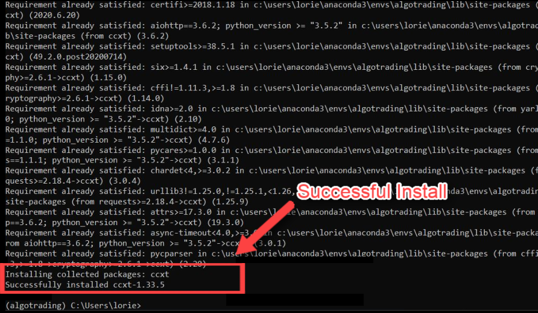
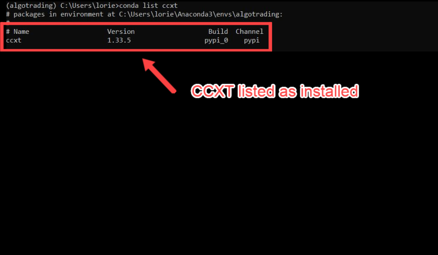
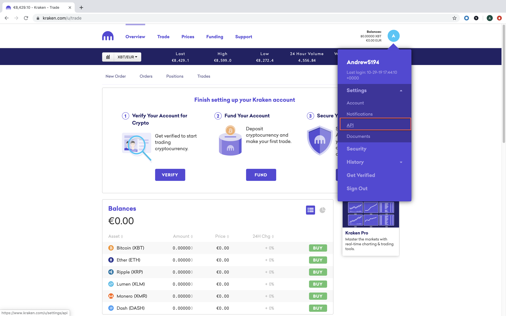
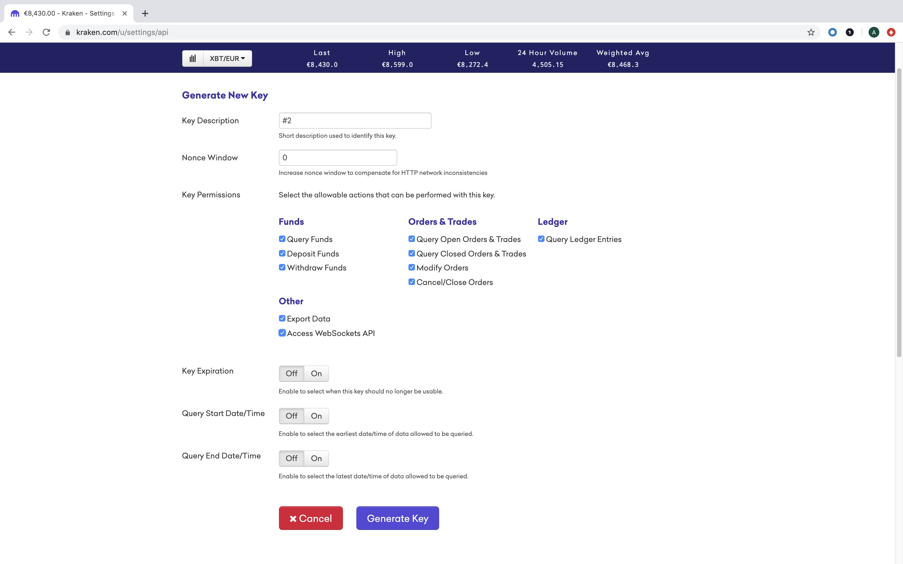
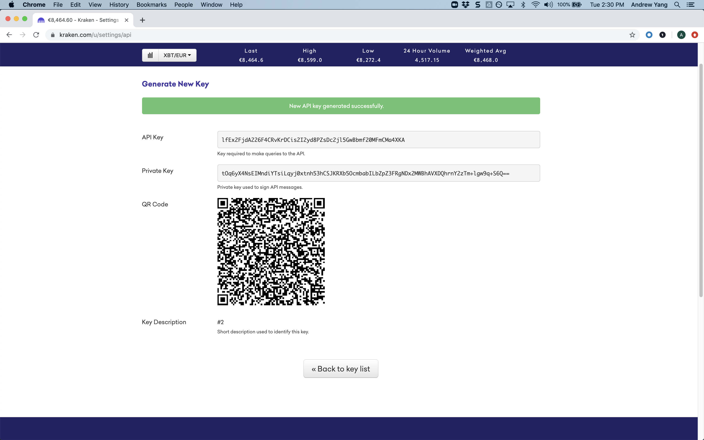
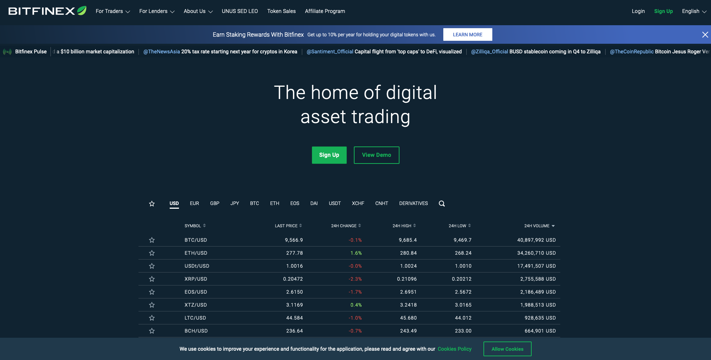

# CCXT Installation Guide

This guide serves as a step by step process for setting up and validating the ccxt Python library. Without this library, class activities and their associated code will not be able to pull historical and current pricing data from the Kraken Cryptocurrency Exchange.

All packages should be installed into the `algotrading` virtual environment.  If you have not already created an `algotrading` virtual environment you can do so by typing the following commands in your terminal:

  ```shell
  conda create -n algotrading python=3.7 anaconda
  ```

## Installation

Open a terminal, and execute the following commands to install `ccxt`.

* Activate your `algotrading` virtual environment.

  ```shell
  conda activate algotrading
  ```

* Use the `pip install` command to download the `ccxt` module.

  ```shell
  pip install ccxt
  ```

  

## Verify Installation

Once the `ccxt` module is downloaded and installed, verify that the installation completed successfully.

* Use the `conda list package_name` command, substituting `package_name` with `ccxt` to identify if the `ccxt` library installed successfully.

  ```shell
  conda list ccxt
  ```

  

## Environment Variable Setup

Now that the `ccxt` module has been installed and verified, go to the [Kraken Cryptocurrency Exchange](https://www.kraken.com/en-us/) and sign up for an account.

- Kraken does not offer services to residents of Washington state (WA) and New York (NY)

```
If you are signing up from either of these two states, please select a different state when signing up to have full use of the Kraken services.
```

Next, head to the API settings of your Kraken account and generate new API keys. Make sure to select all key permissions.

  

  

  

Then, after generating your API keys, create a new `.env` file for your given project and set the `KRAKEN_PUBLIC_KEY` and `KRAKEN_SECRET_KEY` environment variables, respectively. 

**Note:** Unless you are setting these environment variables globally or permanently, they will need to be set each time you want to access the Kraken API via the ccxt library.

### Alternative API Bitfinex

If you are having API request issues with Kraken, as an alternative go to the [Bitfinex Cryptocurrency Exchange](https://bitfinex.com/) and sign up for an account. You can request a simple API key in the same manner. **NOTE:** Citizens of the United States may be presented with a warning message asking if they are a "prohibited person". United States citizens are not currently permitted to trade on Bitfinex, however using the API is allowed. As such, you may proceed by selecting that you are "not a prohibited person".

Then, after generating your API keys, create a new `.env` file for your given project and set the `BITFINEX_PUBLIC_KEY` and `BITFINEX_SECRET_KEY` environment variables, respectively. For the purpose of our usage with `Bitfinex` you can select `No` on prohibited user as you would not be making trades but just requesting data, this will allow usage of the API data request freely. 



## Troubleshooting

It can be frustrating when packages do not install correctly, therefore use the below approaches to troubleshoot any installation or usage issues.

### Update Conda Environment

An out-of-date Anaconda environment can create issues when trying to install new packages. Follow the below steps to update your conda environment.

1. Deactivate your current conda environment. This is required in order to update the global conda environment. Be sure to quit any running applications, such as Jupyter, prior to deactivating the environment.

    ```shell
    conda deactivate
    ```

2. Update conda.

    ```shell
    conda update conda
    ```

3. Remove the virtual environment.

    ```shell
    conda env remove --name algotrading
    ```

4. Create a fresh conda environment to use with `ccxt`.

    ```shell
    conda create -n algotrading python=3.7 anaconda
    ```

5. Activate the new environment.

    ```shell
    conda activate algotrading
    ```

6. Install the `ccxt` package.

    ```shell
    pip install ccxt
    ```

---

© 2020 Trilogy Education Services, a 2U, Inc. brand. All Rights Reserved.
