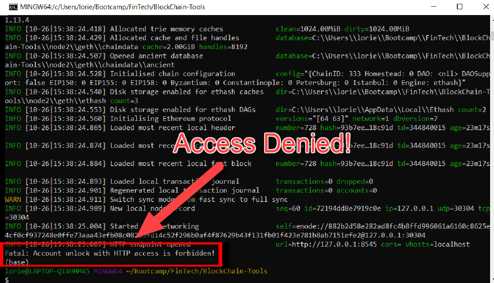

# Activate your local blockchain

Follow these instructions to get your local Ethereum-based blockchain running.  Using this, you can build a cheatsheet to get your `geth` nodes up and running anytime.

## Instructions

---

## Start Node1 

* Start the first node by opening a new terminal and running the following command: 

  ```bash
  ./geth --datadir node1 --unlock "SEALER_ONE_ADDRESS" --mine --minerthreads 1
  ```
* Substitute the "SEALER_ONE_ADDRESS" with the the public address of the first node that was created in the previous session (do **not** include the leading `0x`). 

* Example:

  ```bash
  ./geth --datadir node1 --unlock "f62c095543d750db3a6bd7476952db0e69bf253f" --mine --minerthreads 1
  ```
* **Important:** Type your password and hit enter - _even if you don't see a prompt!_

* Copy the resulting enode address from the terminal:


   

---

## Start Node2

Commands differ based on OS; choose your system below.

<details><summary>Windows</summary>

* Start node two by opening a second new terminal and running the following command: 

  ```bash     
  ./geth --datadir node2 --unlock "SEALER_TWO_ADDRESS" --port 30304 --rpc --bootnodes "SEALER_ONE_ENODE_ADDRESS" --ipcdisable --allow-insecure-unlock   
  ```
* Substitute the "SEALER_TWO_ADDRESS" with the the public address of the second node that was created in the previous session. (do **not** include the leading `0x`).

* Substitute the "SEALER_ONE_ENODE_ADDRESS" with the enode address of node 1 that was copied in step 1.  

* For example:

  ```bash
  ./geth --datadir node2 --unlock "0a8435117d77c184fd35a75d4dce4390369094f7" --port 30304 --rpc --bootnodes "enode://330481ab62dbf7fc47213e83975196156b0d842c4c81439dd888ff2de20afd174ac2062229376f9b8d0c70c31eaa2c8d5f0105db97ea4f72a50839b2b9c6c8f9@127.0.0.1:30303" --ipcdisable --allow-insecure-unlock
  ```  

* **Important**: Type your password and hit enter - _even if you don't see a prompt!_

* The chain should be up and running after you start the second node.

</details>

<details><summary>macOS</summary>

* Start node two by opening a second new terminal and running the following command: 

  ```bash
  ./geth --datadir node2 --unlock "SEALER_TWO_ADDRESS" --port 30304 --rpc --bootnodes "SEALER_ONE_ENODE_ADDRESS" --allow-insecure-unlock
  ```
* Substitute the "SEALER_TWO_ADDRESS" with the the public address of the second node that was created in the previous session. (do **not** include the leading `0x`).

* Substitute the "SEALER_ONE_ENODE_ADDRESS" with the enode address of node 1 that was copied in step 1.  

* For example:

  ```bash
  ./geth --datadir node2 --unlock "0a8435117d77c184fd35a75d4dce4390369094f7" --port 30304 --rpc --bootnodes "enode://330481ab62dbf7fc47213e83975196156b0d842c4c81439dd888ff2de20afd174ac2062229376f9b8d0c70c31eaa2c8d5f0105db97ea4f72a50839b2b9c6c8f9@127.0.0.1:30303" --allow-insecure-unlock
  ```

* **Important**: Type your password and hit enter - even if you don't see a prompt!

* The chain should be up and running after you start the second node.

</details>

---

## Troubleshooting

<details><summary>Access is denied error</summary>

  * Access being denied is a common error.
  
  
    

  * To resolve:
    * Add the flags `--allow-insecure-unlock`
    * Enter your password if prompted. 
    * It may be difficult to see the password prompt (as seen in the image below), however you must still input the password and hit enter for the chain to begin mining.

    
    
</details>

<details><summary>Wallet Amounts Change/Transactions Stay Pending</summary>

  * If you aren't seeing any movement in the wallet amounts in MyCrypto after sending/receiving transactions, make sure you are sending a large enough sum of ETH to see actual movement in the digits. You may have to click on the amount itself to see the full value down to the WEI.
    

* If increasing the transaction value and clicking on the wallet amount doesn't help, try the following:
    * Terminate both nodes using `control+C` in the Node1 and Node2 terminal windows.
    * Change networks in MyCrypto to a Testnet such as Kovan.
    * Restart Node1 and Node2 in their terminal windows.
    * Reconnect to your network in MyCrypto.
    * Log into your wallet and refresh the amount.

</details>

<details><summary>Geth Version</summary>

* If you are still having trouble:
  
  * Verify your Geth version by running the command:
  ` ./geth version`
  * The resulting version number should be `1.9.7`
  * If it's not, repeat the installation instructions from [Unit 18](../../../Supplemental/go-ethereum-tools-install.md), then recreate your blockchain.
</details>

---

## Final Note

Once you get the chain running, copy and paste the commands you used for each node into a README.md inside your network's folder. This will allow you to get your chain started anytime.
